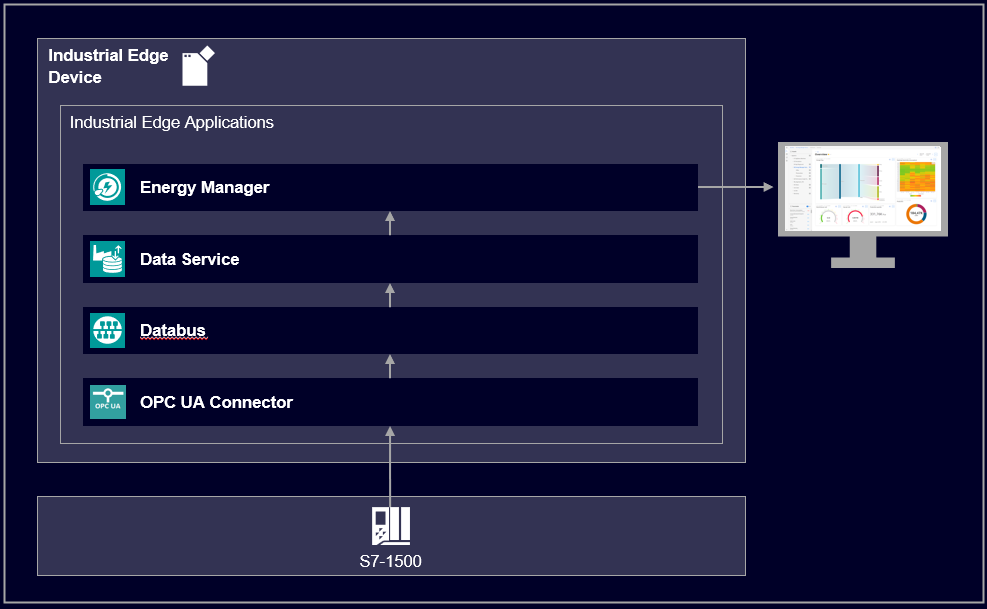

# Energy Manager application example

This guide shows how to use the Industrial Edge application Energy Manager.

- [Energy Manager application example](#energy-manager-application-example)
  - [Description](#description)
    - [Overview](#overview)
    - [General task](#general-task)
  - [Requirements](#requirements)
    - [Prerequisities](#prerequisities)
    - [Used components](#used-components)
    - [TIA Project](#tia-project)
  - [Configuration steps](#configuration-steps)
  - [Usage](#usage)
  - [Documentation](#documentation)
  - [Contribution](#contribution)
  - [Licence and Legal Information](#licence-and-legal-information)

## Description

### Overview

The application Energy Manager provides information about how much energy has been consumed at any time. It will help to make the transition from energy transparency to energy efficiency. By analyzing the energy consumption together with the process data, processes and plants can be optimized. The Energy Manager provides one or more dashboards for data and energy analysis. Depending on the needs, there are several widget types available.

This repository describes how to use the Energy Manager for analyzing and optimizing energy consumption.

### General task

A PLC controls a filling process and the relevant energy data is collected by an Edge Device via the SIMATIC S7 Connector. On the Edge Device the data is published to the internal Databus. Then the data must be collected and modeled via the Data Service. From there the Energy Manager can retrieve the data for further analysis. A custom dashboard with several widgets is created to visualize the energy data. Furthermore a KPI value is calculated and displayed.

## Requirements

### Prerequisities

- Access to an Industrial Edge Management (IEM) with onboarded Industrial Edge Device (IED)
- Installed system configurators and apps (see list "Used components")
- Installed apps (see list "Used components")
- IED is connected to PLC
- TIA portal project loaded on PLC
- Google Chrome (Version ≥ 72)

### Used components

- Industrial Edge Management (IEM) V1.4.0-42 / V1.5.6
  - IE Databus Configurator V 1.6.19
  - S7 Connector Configurator V 1.6.0-7
- Industrial Edge Device (IED) V 1.2.0-56
  - IE Databus V 1.6.3
  - S7 Connector V 1.6.0-8
- Data Service V 1.3.3
- Energy Manager V1.3.2
- TIA Portal V16
- CPU 1513-1
- Google Chrome

### TIA Project

The used TIA Portal project can be found in the [miscellenous repository](https://github.com/industrial-edge/miscellaneous/tree/main/tank%20application) and is also used for several further application examples.

## Configuration steps

You can find the further information about the following steps in the [docs](docs/Installation.md)

- Configure PLC Connection
- Configure Energy Manager

## Usage

Once the Energy Manager is configured, data such as energy consumption, energy costs and energy flows can be visually displayed via the web UI interface.  

## Documentation

You can find further documentation and help in the following links

- [Industrial Edge Hub](https://iehub.eu1.edge.siemens.cloud/#/documentation)
- [Industrial Edge Forum](https://www.siemens.com/industrial-edge-forum)
- [Industrial Edge landing page](https://new.siemens.com/global/en/products/automation/topic-areas/industrial-edge/simatic-edge.html)
  
## Contribution

Thanks for your interest in contributing. Anybody is free to report bugs, unclear documenation, and other problems regarding this repository in the Issues section or, even better, is free to propose any changes to this repository using Merge Requests.

## Licence and Legal Information

Please read the [Legal information](LICENSE.md).
