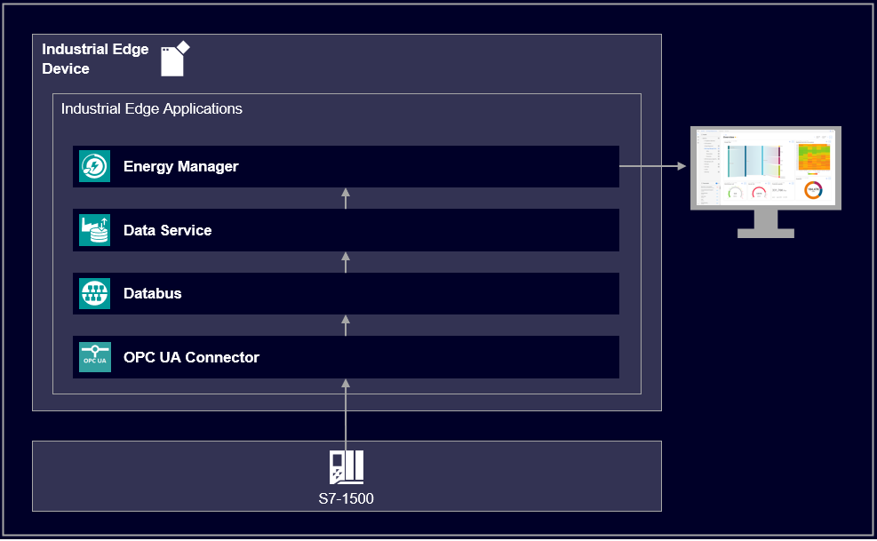

# Energy Manager application example

This guide shows how to use the Industrial Edge application Energy Manager.

- [Energy Manager application example](#energy-manager-application-example)
  - [Description](#description)
    - [Overview](#overview)
    - [General task](#general-task)
  - [Requirements](#requirements)
    - [Prerequisities](#prerequisities)
    - [Used components](#used-components)
    - [TIA Project](#tia-project)
  - [Configuration steps](#configuration-steps)
  - [Usage](#usage)
  - [Documentation](#documentation)
  - [Contribution](#contribution)
  - [Licence and Legal Information](#licence-and-legal-information)

## Description

### Overview

The application Energy Manager provides information about how much energy has been consumed at any time. It will help to make the transition from energy transparency to energy efficiency. By analyzing the energy consumption together with the process data (such as temperatures, pressures etc.), processes and plants can be optimized. The recorded energy data provide more planning reliability.
The Energy Manager provides one or more dashboards for data and energy analysis. Depending on the needs, there are several widget types available.

This repository describes how to use the Energy Manager for analyzing and optimizing energy consumption.

### General task

The example reads the PLC data from the Data Service and displays it visually in Energy Manager. 
The data is published via the S7 connector, Databus and on the Data Service, where Energy Manager can retrieve the desired data. 
First, the S7 configurator and the Databus must be configured. Then, in the Data Service, select the required data that will later be displayed in the Energy Manager. In the Energy Manager, you select the data from the Data Service and visualize it using widgets such as Sankey, Heatmap or Duration curve or calculate the current energy consumption using a KPI and display it visually.

## Requirements

###  Prerequisities

- Access to an Industrial Edge Management System (IEM)
- Onboarded Industial Edge Device on IEM
- Installed System Configurators for Databus and S7 Connector
- Installed System Apps Databus and S7 Connector
- Installed Apps Data Service, Energy Manager
- Edge device is connected to PLC
- TIA portal project loaded on PLC (e.g. for filling application)
- Google Chrome (Version ≥ 72) or Firefox (Version ≥ 62)

### Used components

- Industrial Edge Management (IEM) V1.2.0-34
- S7 Connector Configurator V1.2.38
- S7 Connector V1.2.26
- IE Databus Configurator V1.2.29
- IE Databus V1.2.16
- Data Service V1.1.1
- Energy Manager V1.2.0
- Industrial Edge Device V 1.2.0-56
- TIA Portal V16
- S7-1511
- Web browser (Mozilla or Chrome)

### TIA Project

The used TIA Portal project can be found in the [miscellenous repository](https://github.com/industrial-edge/miscellaneous/tree/main/tank%20application) and is also used for several further application examples.

## Configuration steps

You can find the further information about the following steps in the [docs](docs/Installation.md)
- Configure PLC Connection
- Configure Energy Manager

## Usage

Once the Energy Manager is configured, data such as energy consumption, energy costs and energy flows can be visually displayed via the web UI interface.  

## Documentation

You can find further documentation and help in the following links
  - [Industrial Edge Hub](https://iehub.eu1.edge.siemens.cloud/#/documentation)
  - [Industrial Edge Forum](https://www.siemens.com/industrial-edge-forum)
  - [Industrial Edge landing page](https://new.siemens.com/global/en/products/automation/topic-areas/industrial-edge/simatic-edge.html)
  
## Contribution

Thanks for your interest in contributing. Anybody is free to report bugs, unclear documenation, and other problems regarding this repository in the Issues section or, even better, is free to propose any changes to this repository using Merge Requests.

## Licence and Legal Information

Please read the [Legal information](LICENSE.md).
