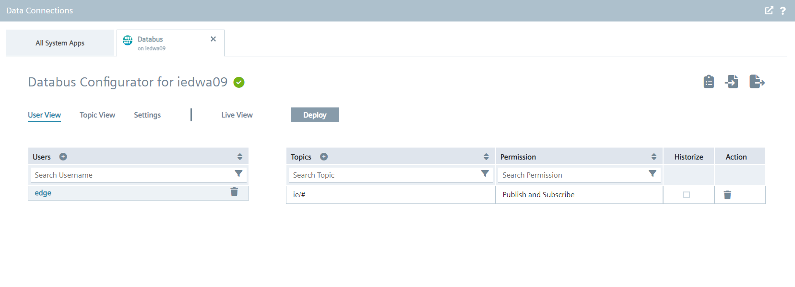
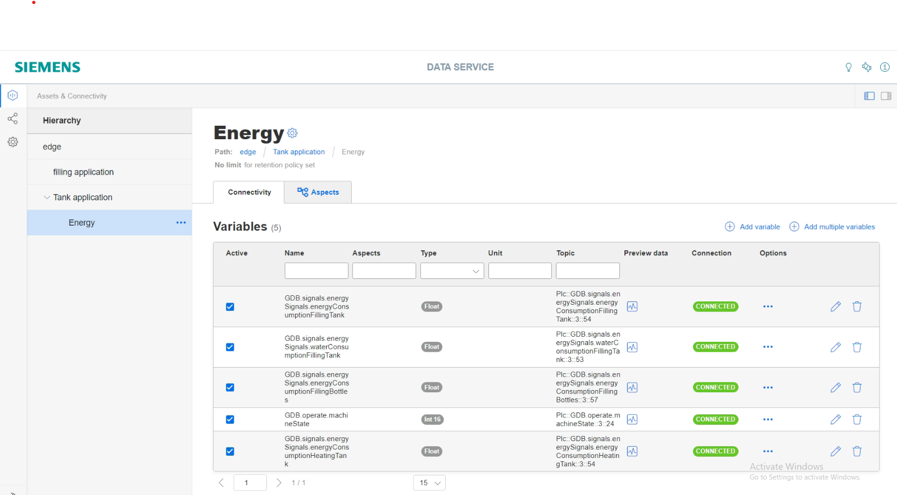

# Configuration

- [Configuration](#configuration)
  - [Configure PLC Connection](#configure-plc-connection)
    - [Configure Databus](#configure-databus)
    - [Configure S7 Connector](#configure-s7-connector)
    - [Configure Data Service](#configure-data-service)
  - [Configure Energy Manager](#configure-energy-manager)
    - [Create Sankey Diagram](#create-sankey-diagram)
    - [Create Duration Curve](#create-duration-curve)
    - [Create KPI](#create-kpi)
    - [Create Heatmap Diagram](#create-heatmap-diagram)
    - [Create Cost Calculation](#create-cost-calculation)
    - [Create Line Diagram](#create-line-diagram)
    - [Create Bulk Diagram](#create-bulk-diagram)
    - [Create Energy Media Analysis](#create-energy-media-analysis)
    - [Create Gantt Diagram](#create-gantt-diagram)

## Configure PLC Connection

To read data from the PLC and provide the data, we will use S7 Connector to establish connection with the PLC via OPC UA.

The S7 Connector sends the data to the Databus, where the Data Service app can collect what is needed.

In order to build this infrastructure, these apps must be configured properly:

- Databus
- S7 Connector
- Data Service

### Configure Databus

In your IEM open the Databus and launch the configurator.

Add a user with this topic:
`"ie/#"`

Deploy the configuration.

### Configure S7 Connector

In your IEM open the S7 Connector and launch the configurator.

Add a data source:

Add needed tags:

Edit the settings:

Hint: Username and password should be the same for all system apps, e.g. "edge" / "edge".

Deploy and start the project.

### Configure Data Service

In your IED open the Data Service 

Add a SIMATIC S7 Connector:

Edit the settings with you use in S7 Connector:

click on "Assets & Connectivity" at the top of the left-hand page and create your first variables.

Select the S7 Connector in "Choose an Adapter" and all "GDB_signals_energySignals_" in "choose a tag":

click on "Aspects" and select all "GDB_signals_energySignals_":

## Configure Energy Manager

In your IED Web UI open the app Energy Manager

### Create Sankey Diagram

​Using the ​Sankey diagram​, energy flows can be displayed as arrows whose width is proportional to the flow rate. This makes it easy for you to recognize, for example, how energy is flowing through your plant.

First you need to create a dashboard, klick on "add dashboard"

Click "My Plant" at the top of the left side and create first widget:

Select the Sankey Diagram widget:

Create nodes which will be linked to the parameters. Select a colour for the respective nodes:

Link the nodes with the parameters of the respective parameters. Note the energy flow of the respective parameters:

Create Sankey diagram of combined energy and water consumption including single energy and water values:

### Create Duration Curve

​By using the ​duration curve​, you can display a chart sorted by size. ​In the ​duration curve​, the measured values of a specific time range are displayed collected and sorted. The highest value is displayed on the far left, and the lowest value on the far right.

Select the Duration Curve widget:

Create single Duration Curve diagrams for each energy and water consumption value:

### Create KPI

Click on "Configuration" on the left side and select "KPI types":

Create a new KPI type, klick on "New KPI type".

Create a calculation of the total energy consumption via KPI formula:

### Create Heatmap Diagram

​Using the ​Heatmap​, you can visualize the intensity of data values over time. You can, for example, display the energy consumption (red = high energy consumption; green = low energy consumption), temperatures or production quantities in a specific time range.

Select the Heatmap widget:

Create Heatmap diagram of total energy consumption based on KPI:

### Create Cost Calculation 

Calculation of the costs for energy and water via KPI formula. Calculation of total costs per bottle via KPI formula.

Created KPI type “KPI costs energy total” and “KPI costs total”:

### Create Line Diagram

Create line diagram of costs for energy and water and total costs per bottle based on KPI:

### Create Bulk Diagram

Calculation/Aggregation of energy consumption within 15 minutes:

Create Bulk diagram for aggregated energy consumption:

### Create Energy Media Analysis

​You use the energy media analysis to manage and calculate energy data, such as power and gas from the machines and plants. In the configuration, you create all required energy media and can then define for each asset which energy data it requires. Using the stored contract information, you can then convert the consumption of the individual energy media directly into the resulting costs and CO2 emissions.

Select your dashboard and click on the name of the dashboard. Click on the "Asset Configuration":

Click on "Assignment of energy medium":

Click on "New row" to select the Energy Medium, for configure the Energy Media click on "Energy medium":

Go back to "Asset Configuration" and click on "Contract Information".

Click on "Add energy medium" to select your energy medium.

Configure the contract information for your energy medium and the currency:

​Next, you can display the energy media analysis directly in the energy media dashboard. The dashboard is displayed automatically:

### Create Gantt Diagram

​The Gantt widget shows you the status of a machine at a glance using different color codes. For example, the status can represent the current state or the state within a specific time range.

Select the Heatmap widget:

Creating status mappings for the "Gantt" widget:

Click on the "Enable Zoom" button to zoom in on the Gantt Chart too see the Machine Status better:

