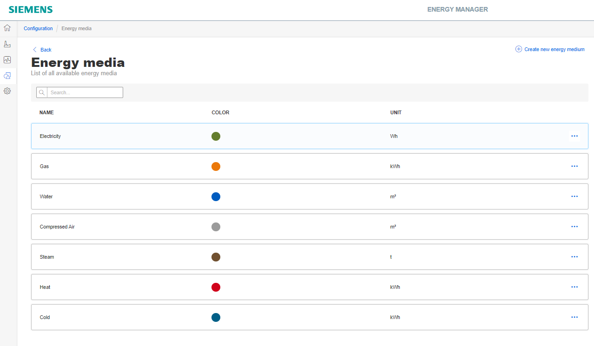
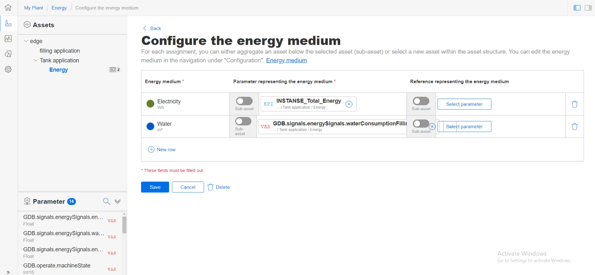
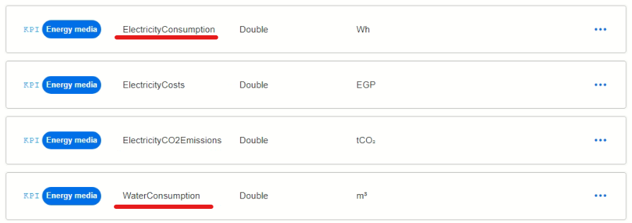
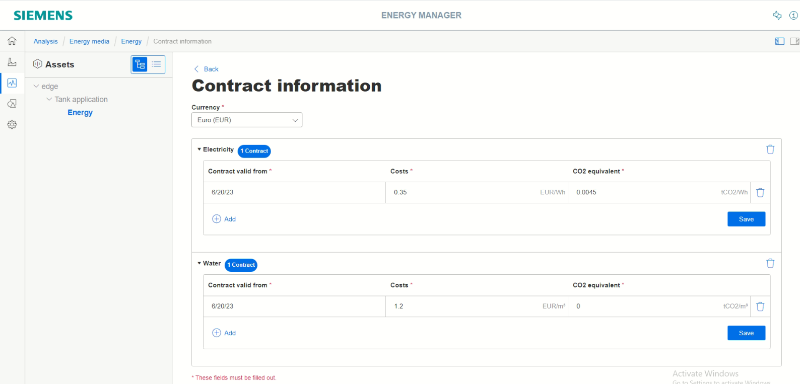

# Usage

- [Usage](#usage)
  - [Energy Manager: KPI calculation](#energy-manager-kpi-calculation)
    - [Create KPI type](#create-kpi-type)
    - [Create KPI instance](#create-kpi-instance)
  - [Energy Manager: Data analysis with widgets](#energy-manager-data-analysis-with-widgets)
    - [Create heatmap diagram](#create-heatmap-diagram)
    - [Create diagram](#create-diagram)
    - [Create sankey](#create-sankey)
    - [Create duration curve](#create-duration-curve)
  - [Energy Manager: Energy media analysis](#energy-manager-energy-media-analysis)
    - [Configuration of energy media](#configuration-of-energy-media)
    - [Configuration of asset](#configuration-of-asset)
    - [Defining contract information](#defining-contract-information)
    - [Displaying the energy media analysis](#displaying-the-energy-media-analysis)

## Energy Manager: KPI calculation

KPI stands for **Key Performance Indicator**. KPI types are formulas made up of operands, constants, and operators. A KPI instance can be created either during the widget configuration or in the parameter list on the asset. KPI types can be instantiated multiple times. When you make changes to the KPI type, these changes are also implemented in all KPI instances.

Open the app Energy Manager on your Industrial Edge Device.

### Create KPI type

In this example a KPI type could be:

```
Total energy = Energy filling tank + Energy heating tank + Energy filling bottles
```

Follow these steps to create a new KPI type:

- select the tab "Configuration"
- choose "KPI types"
- click "New KPI type"
- enter a unique name and a unit
- in the formula editor, use operants and operators to create this formula:


- save the KPI type

It is also possible to create a **cost calculation** via KPI formulas. In this example we calculate the energy costs as well as the water costs.

Create two further KPI types:

```
Costs energy = Total energy * 0.35
```


```
Costs water = Water consumption * 0.21
```


### Create KPI instance

KPI instances can be created either in the parameter list of an asset or in the "Parameter" step when a widget is created. They can be derived from a KPI type or can be created typeless. Automatic KPI instances are created additionally when you create energy media and assign contract information. New KPI instances cause costs. The number of currently used KPI instances is displayed in the tab "Settings" under "Usage information".

Follow these steps to create a KPI instance in the parameter list based on our KPI type 'Total energy':

- select the tab "My Plant"
- go to the dedicated asset "Energy" and open the parameter view


- click "New KPI instance" to add an instance
- enter a unique instance name
- select "On the basis of a KPI type"
- select the KPI type for 'Total energy'
- link all operands to a variable coming from Data Service and set the aggregation to "Last"


- save the KPI instance

## Energy Manager: Data analysis with widgets

Within the Energy Manager you can create custom dashboards for data analysis. The input data comes from the previously configured app Data Service. The modelled data structure is then automatically displayed in the Energy Manager navigation tree.

At least one dashboard must be created on the dedicated asset:

- select the tab "My Plant"
- go to the dedicated asset "Energy"
- click "Create first dashboard"
- enter a name for the dashboard and save


Depending on the needs, there are several widget types available:


Below it is described how to create some characteristic widgets for energy data.

### Create heatmap diagram

Using the Heatmap, you can visualize the intensity of data values over time.

You can, for example, display the energy consumption (red = high energy consumption; green = low energy consumption) in a specific time range. Here we create the Heatmap based on the previously generated KPI instance 'Total energy':

- select the tab "My Plant"
- go to the newly created dashboard
- select "Create first widget" to start the wizard

1) choose the Heatmap widget type > Continue
2) enter a widget name and set the KPI calculation period to 1 Minute > Continue
3) click "Select parameter" and choose the KPI instance for 'Total energy' > Continue
4) no need to change anything in the general display options > Continue
5) no need to change anything in the Heatmap display options > Finish

This Heatmap now shows the total energy consumption over one day:


### Create diagram

Using the Diagram widget, you can display parameter values or calculated KPI values over time. There are several diagram types available. Also different aggregation functions can be selected for the values.

**Bulk diagram**

Here we want to display the KPI value for 'Total energy' for every 15 minutes as bulk diagram:

- go to the dashboard
- click the settings button and choose "New widget" to start the wizard

1) choose the Diagram widget type > Continue
2) enter a widget name and set the KPI calculation period to 15 Minutes > Continue
3) click "Select parameter" and choose the KPI instance for 'Total energy' > Continue
4) no need to change anything in the general display options > Continue
5) choose "Bar" in the dropdown field for the chart type > Finish


**Line diagram**

Here we want to display the consumption costs for energy and water as line diagram. The diagram is based on the predefined KPI types 'Costs energy' and 'Costs water', but the KPI instances must be defined within the wizard:

- go to the dashboard
- click the settings button and choose "New widget" to start the wizard

1) choose the Diagram widget type > Continue
2) enter a widget name and set the KPI calculation period to 15 Minutes > Continue
3) click "New KPI instance" to create an instance based on the KPI type 'Costs energy', enter a name, select the KPI type and link the parameter 'TotalEnergy' to the already existing instance of 'Total Energy'


3) Again click "New KPI instance" to create an instance based on the KPI type 'Costs water', enter a name, select the KPI type and link the parameter 'WaterConsumption' to the signal 'waterConsumptionFillingTank' with aggregation 'Last' > Continue


4) no need to change anything in the general display options > Continue
5) no need to change anything in the Chart display options > Finish


### Create sankey

Using the Sankey diagram, energy flows can be visualized. The energy flows are displayed as arrows whose width is proportional to the flow rate.

Here we want to display the water and energy consumption as Sankey:

- go to the dashboard
- click the settings button and choose "New widget" to start the wizard

1) choose the Sankey widget type > Continue
2) enter a widget name and set the KPI calculation period to 1 Minute > Continue
3) click "Select parameter" and choose the energy and water parameter (hint: choose them in the order you would like to see them in the diagram), for all set aggregation to 'Last' > Continue


4) no need to change anything in the general display options > Continue
5) in the tab 'Nodes' you need to create nodes with proper colours, that are later linked to the parameter:


5) go to the tab 'Links' and specify the links for each parameter from source node to destination node (you can also scale a link to show the proportions right):


5) Finish


### Create duration curve

By using the duration curve, you can display a chart sorted by size. In the duration curve, the measured values of a specific time range are displayed collected and sorted. The highest value is displayed on the far left, and the lowest value on the far right.

Here we want to display the KPI value for 'Total energy' as duration curve:

- go to the dashboard
- click the settings button and choose "New widget" to start the wizard

1) choose the Duration Curve widget type > Continue
2) enter a widget name and set the KPI calculation period to 1 Minute > Continue
3) click "Select parameter" and choose the KPI instance for 'Total energy' > Continue
4) no need to change anything in the general display options > Continue
5) no need to change anything in the Heatmap display options > Finish


## Energy Manager: Energy media analysis

You use the energy media analysis to manage and calculate energy data, such as power and gas from the machines and plants. In the configuration, you create all required energy media and can then define for each asset which energy data it requires. Using the stored contract information, you can then convert the consumption of the individual energy media directly into the resulting costs and CO2 emissions.

### Configuration of energy media

The Energy Manager provides already some predefined energy media, but it is also possible to add further ones.

- select the tab "Configuration"
- choose "Energy media" to open a list of all existing energy media
- some energy media are predefined, in our case "Electricity" and "Water" are suitable
- edit the "Electricity" media and change the unit to "Wh", so that it suits to our process data



### Configuration of asset

For each asset in the Energy Manager, you can define which energy media is required. Then parameter can be assigned properly.

Here we specifiy one asset:

- select the tab "My Plant"
- go to the asset you want to specify
- click on the asset name and select "Asset Configuration"
- choose "Assignment of energy medium"


- add a new row and select "Electricity" as energy medium
- in the parameter column, click "Select parameter" to assign a suitable process value, here we choose the KPI instance for 'Total Energy'
- add a new row and select "Water" as energy medium
- in the parameter column, click "Select parameter" to assign a suitable process value, here we choose the parameter 'waterConsumption' and select "Last" as aggregation type
- save the configuration



By assigning parameters that represent the energy medium, all KPI instances required for the energy media analysis are automatically created in the parameter list.



### Defining contract information

You can also store following contract information for each energy medium: Contract valid from, Currency, Costs, CO2 equivalent.

Here we define the contract information for one asset:

- select the tab "My Plant"
- go to the asset you want to specify
- click on the asset name and select "Asset Configuration"
- chosse "Contract information"
- set the currency to "Euro (EUR)"
- add the energy medium "Electricity"
- open the settings and add a contract
- configure the contract information and save
- add the energy medium "Water"
- open the settings and add a contract
- configure the contract information and save



### Displaying the energy media analysis

The energy media analysis is automatically displayed in the energy media dashboard:

- select the tab "My Plant"
- go to the asset you just specified
- the energy media dashboard is generated automatically as first dashboard within the asset
- you can display either the collective information for all energy media or for each single energy medium


